# 网页时装购物系统

#### 介绍
本网页时装购物系统是一个专为时尚爱好者设计的在线购物平台。该平台凭借其全面的功能和友好的用户体验，为用户提供一站式的购物服务。系统不仅提供了丰富的商品信息和便捷的购物流程，还通过个性化推荐和社交互动功能，增强了用户的购物体验。

#### 技术栈介绍
后端技术栈：Springboot+Mysql+Maven

前端技术栈：Vue+Html+Css+Javascript+ElementUI

开发工具：Idea+Vscode+Navicate

#### 系统功能介绍

一、管理端功能模块

用户管理：管理员可以添加、删除、编辑用户信息，并设置用户权限，以确保平台的安全性和用户权益。  

商品分类管理：管理员负责创建、修改、删除商品分类，构建清晰的商品分类结构，方便用户查找所需商品。  
  
颜色管理：管理员录入和编辑商品颜色信息，确保商品信息的准确性和完整性，提升用户购物体验。  

商品信息管理：管理员负责添加、修改、删除商品信息，包括商品名称、价格、库存、描述、图片等，确保商品信息的实时更新和准确性。  

商品评价管理：管理员审核用户提交的商品评价，确保评价内容的真实性和合法性，维护良好的购物环境。  

系统管理：管理员设置系统参数，监控系统运行状态，确保系统的稳定运行和安全性。  

订单管理：管理员查看、处理用户提交的订单，如确认订单、发货、退款等，保证订单处理的及时性和准确性。  

二、用户端功能模块

商品信息：用户可以浏览各类商品信息，通过搜索和筛选功能快速找到所需商品。  

商品资讯：系统发布时尚资讯、搭配指南等内容，为用户提供购物参考和灵感。  

个人中心：用户可以查看和修改个人信息，管理购买记录、收藏夹等个人信息。  

购物车：用户可以将心仪的商品加入购物车，方便统一结算和查看购物清单。  

客服：提供在线客服功能，解答用户疑问，提供购物帮助和咨询。 

商品评论管理：用户可以对购买的商品进行评价，分享购物体验，同时查看其他用户的评价以供参考。 

我的收藏管理：用户可以收藏感兴趣的商品或页面，方便日后查看和管理。  

订单管理：用户可以查看自己的订单详情，包括订单状态、物流信息等，对订单进行取消、退款等操作

#### 系统功能截图

代码结构和数据库
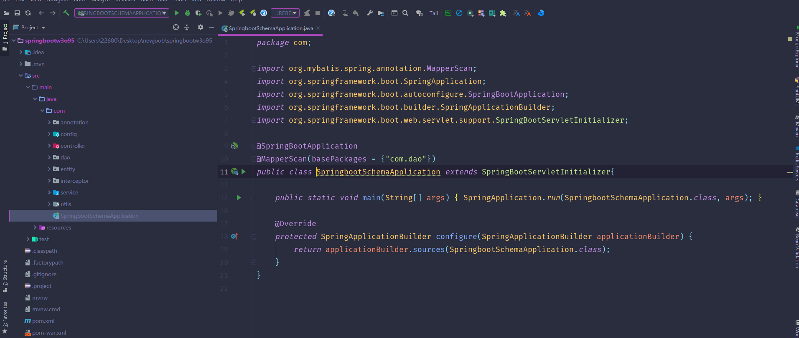

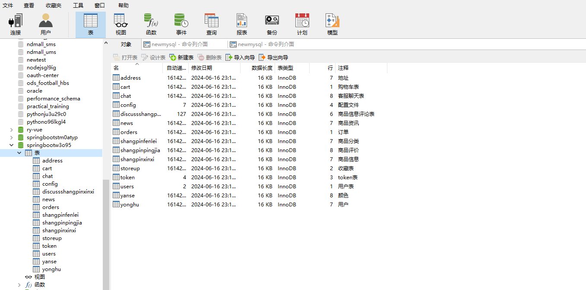

一、管理端

登录

首页

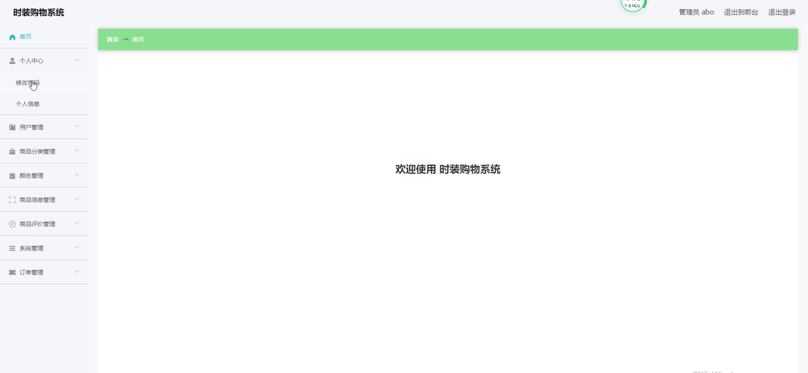

用户管理

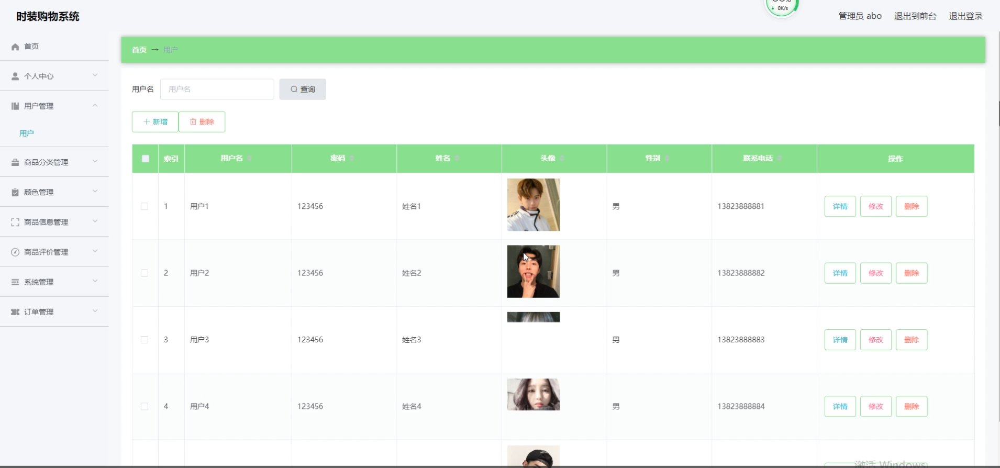

商品分类管理

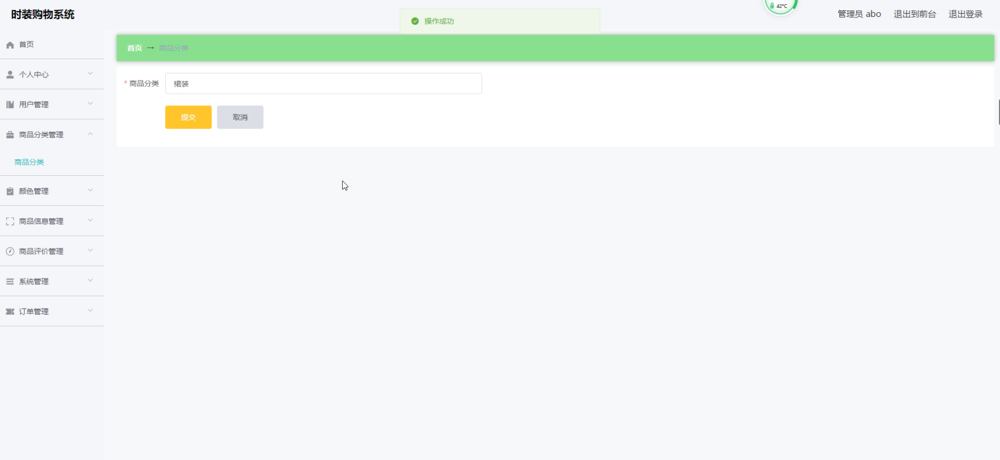

颜色管理

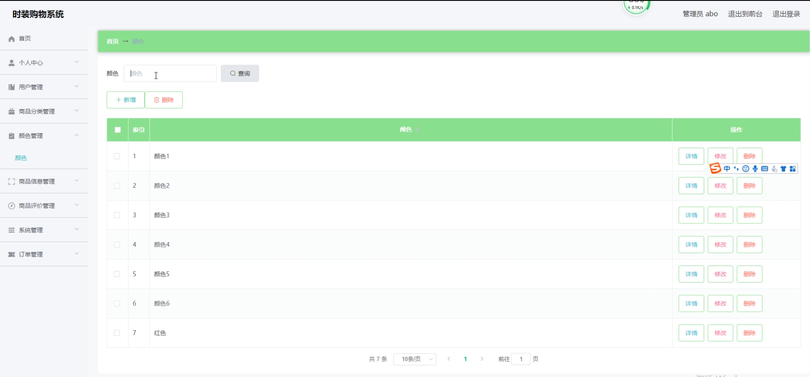

商品信息管理

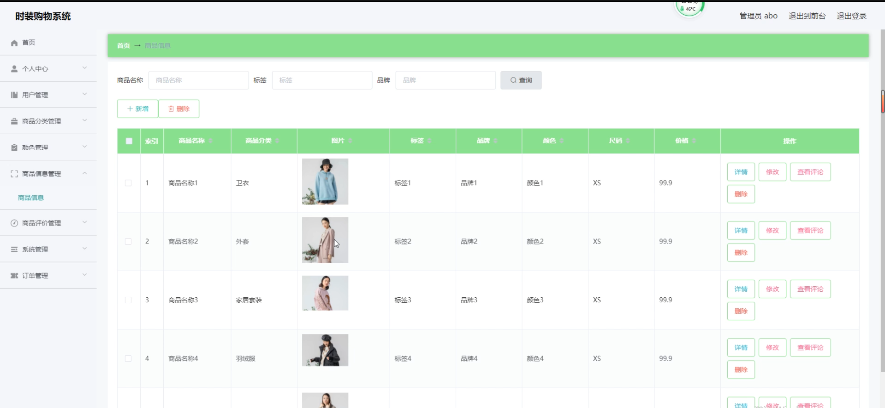

商品评价管理

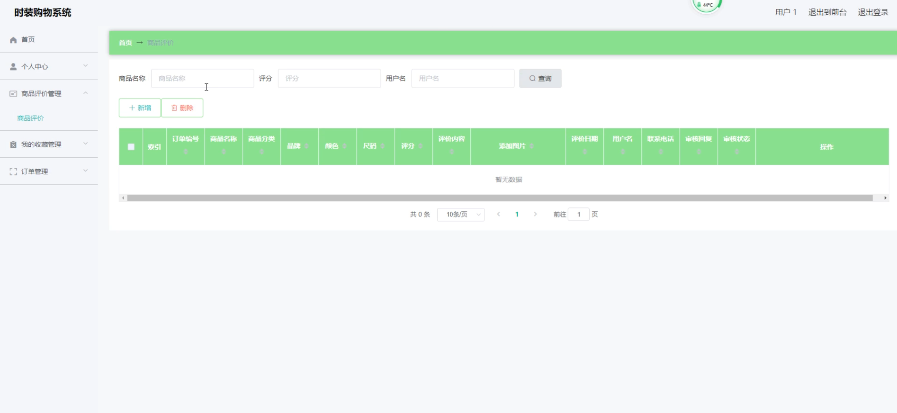

系统管理

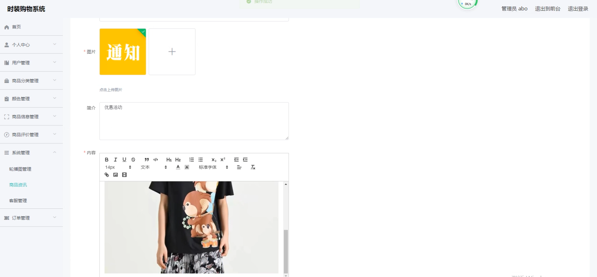

订单管理

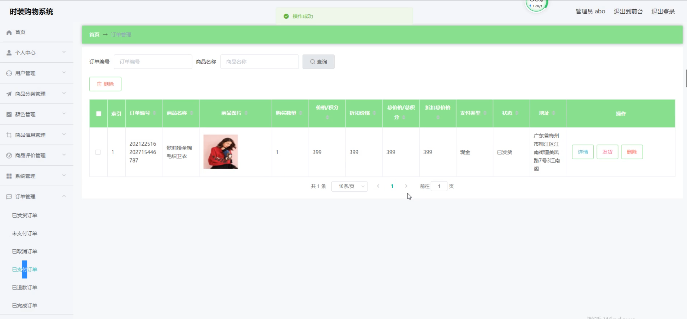

二、用户端

注册

首页

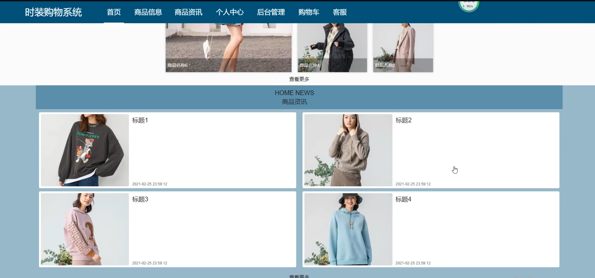

商品信息

商品资讯

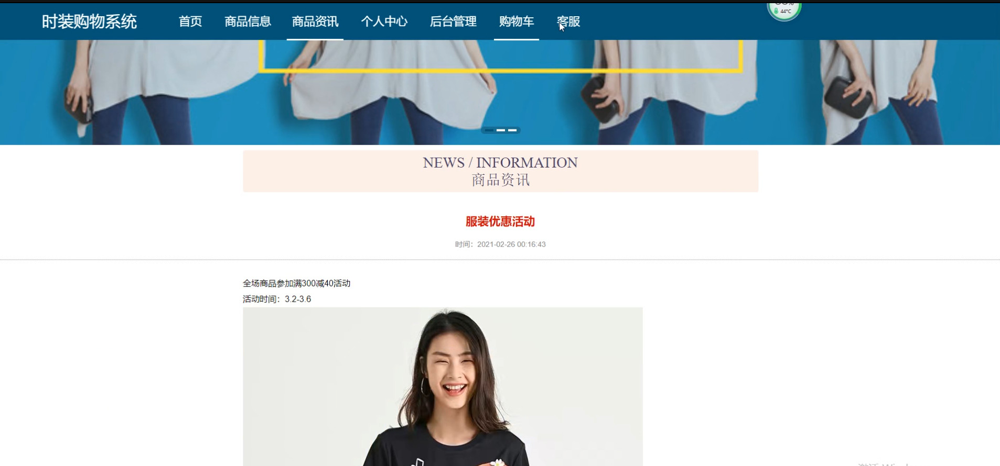

个人中心

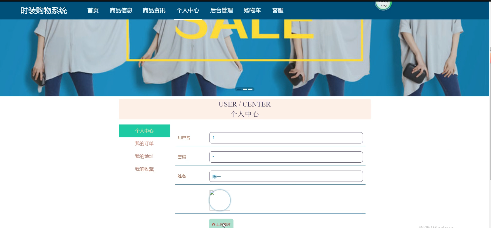

购物车

客服

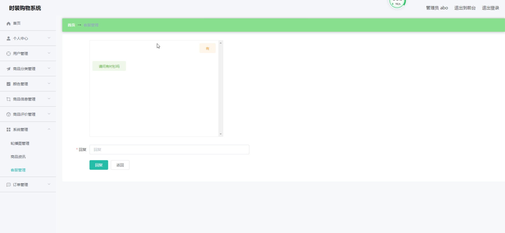

#### 总结

本网页时装购物系统以其全面的管理端和用户端功能模块，为用户提供了便捷、高效、个性化的在线购物体验。通过管理端的功能，管理员能够轻松管理用户和商品信息，确保平台的稳定运行和安全性。用户端的功能则让用户能够享受丰富的购物功能和个性化的购物体验，提升购物满意度。无论是时尚爱好者还是管理员，都能在本系统中找到满足自己需求的功能和服务。

#### 使用说明
创建数据库，执行数据库脚本 修改jdbc数据库连接参数 下载安装maven依赖jar 启动idea中的springboot项目

后台地址：http://localhost:8080/springbootw3o95/admin/dist/index.html

管理员  abo 密码 abo

前台地址：http://localhost:8080/springbootw3o95/front/index.html
